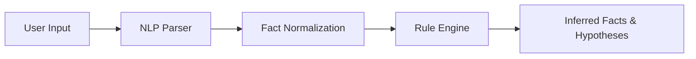

---

## 🧪 Testing

This project includes unit tests for both the NLP parser and the rule engine.

### How to run tests

1. Make sure your virtual environment is activated.
2. Run the following commands:
   ```sh
   python -m unittest test_nlp_utils.py
   python -m unittest test_rule_engine.py
   ```

### What is tested?
- NLP parsing of singular/plural, casing, and multiple fact patterns
- Rule engine inference for common scenarios

You can add more tests to these files to cover your own rules and NLP patterns.
---

## 📖 How it works

1. **Input:**
   - Users enter facts in structured or natural language form (e.g., `has_property(bird, wings)` or `Birds can fly`).
2. **NLP Parsing:**
   - The system uses spaCy to extract entities, properties, and relationships from natural language.
3. **Fact Normalization:**
   - All facts are normalized (e.g., singular/plural forms, casing) for consistent rule matching.
4. **Rule Engine:**
   - Facts are passed to a forward-chaining rule engine, which applies rules from the knowledge base to infer new facts and hypotheses.
5. **Output:**
   - Inferred facts and hypotheses are displayed in the CLI, GUI, or web interface.

**System Flow Diagram:**



---

## ❓ Troubleshooting & FAQ

**Q: Why is my fact not recognized?**
A: Make sure your input matches a supported pattern or is a simple English sentence. Check the help section for examples.

**Q: Why is no hypothesis generated?**
A: Some rules require multiple facts (e.g., all symptoms for flu). Try adding more related facts or check the rules in `knowledge_base.py`.

**Q: Can I use singular or plural?**
A: Yes! The system normalizes both forms, so "feather" and "feathers" are treated the same.

**Q: Can I use names or capitalized entities?**
A: Yes! The parser preserves the original casing for subjects (e.g., "John").

**Q: How do I add my own rules?**
A: Edit `knowledge_base.py` and add new rule dictionaries to the `rules` list.

**Q: How do I reset or clear all facts in the web UI?**
A: Use the "Clear All" button below the facts list.

---
---

## 🌐 Web Interface

You can now use the AI Hypothesis Generator in your browser!

### How to use the web version

1. **Start the backend server:**
   - Open a terminal in your project directory.
   - Run:
     ```sh
     python web/server.py
     ```
   - The server will start at `http://127.0.0.1:5000/` by default.

2. **Open the frontend:**
   - Open `web/index.html` in your browser (double-click or right-click → Open with browser).
   - Enter facts or natural language sentences just like in the CLI/GUI.
   - Click **Add Fact** to add, then **Generate Hypotheses** to see results.

### Features
- Accepts both structured and natural language input.
- Beautiful, modern UI (HTML/CSS/JS).
- Results and hypotheses are shown instantly in the browser.

---
### 🔍 AI Hypothesis Generator (CLI)

#### 💬 How to enter facts:

→ You can now enter facts in two ways:
   1. **Structured format:** `predicate(arg1, arg2)` (e.g., `has_property(sky, dark)`)
   2. **Natural language:** e.g., `X has property feather and can fly`

→ The system will automatically parse simple English sentences like:
   - `The animal has property feathers and can fly`
   - `Birds can swim and have property wings`
   - `X has property fur`

→ Type 'done' when you're finished.

Enter fact: help

🆘 Help - Accepted input formats:

- `has_property(entity, property)` → e.g. `has_property(animal, feathers)`
- `can(entity, ability)` → e.g. `can(animal, fly)`
- `is_a(entity, category)` → e.g. `is_a(bird, animal)`
- `boils_at(entity, temperature)` → e.g. `boils_at(substance, 100C)`
- `makes_sound(entity, sound)` → e.g. `makes_sound(sky, rumbling)`
- `use_sunlight(entity, action)` → e.g. `can(plant, use_sunlight)`
- `has_symptom(entity, symptom)` → e.g. `has_symptom(john, fever)`
- `has_part(entity, part)` → e.g. `has_part(car, wheels)`


Enter fact: X has property feather and can fly
Enter fact: done

📚 Initial Facts:
('has_property', 'X', 'feather')
('can', 'X', 'fly')

🧠 Inferred Facts:
('hypothesis', 'X', 'might_be_a_bird')

💡 Hypotheses:
→ might_be_a_bird

---

## 🖼 GUI (Graphical User Interface) Mode  

### Main Page (`gui.py`)  
  

1. **Fact Entry Box** → Type in your facts here.  
2. **"Show Help" Button** → Displays all supported formats so you never have to memorize them.  

---

### Help Page  
  


**Formats Supported:**
- `has_property(entity, property)` → e.g. `has_property(animal, feathers)`
- `can(entity, ability)` → e.g. `can(animal, fly)`
- `is_a(entity, category)` → e.g. `is_a(bird, animal)`
- `boils_at(entity, temperature)` → e.g. `boils_at(substance, 100C)`
- `makes_sound(entity, sound)` → e.g. `makes_sound(sky, rumbling)`
- `use_sunlight(entity, action)` → e.g. `can(plant, use_sunlight)`
- `has_symptom(entity, symptom)` → e.g. `has_symptom(john, fever)`
- `has_part(entity, part)` → e.g. `has_part(car, wheels)`

**Or use simple English sentences:**
- `The animal has property feathers and can fly`
- `Birds can swim and have property wings`
- `X has property fur`

The system will extract facts from these sentences automatically.

---

### Example Flow in GUI:
1. Enter facts, for example:
   - `has_property(animal, arms)`
   - `can(animal, swim)`
2. Click **Generate Hypothesis** → See generated hypotheses in the result box.  
3. You can:
   - Add more facts (they’ll be added to the existing list)  
   - Or click **Clear All** to start fresh.  

---

---

## 🧠 New Feature: Natural Language Input (NLP)

You can now enter facts as simple English sentences! The system uses NLP to extract facts like `has_property` and `can` from your input. This works in both CLI and GUI modes.

**Example:**
> X has property feather and can fly

is parsed as:
> ('has_property', 'X', 'feather')
> ('can', 'X', 'fly')

Try it out and let us know your feedback!

— *@Chirag_Varu*  
