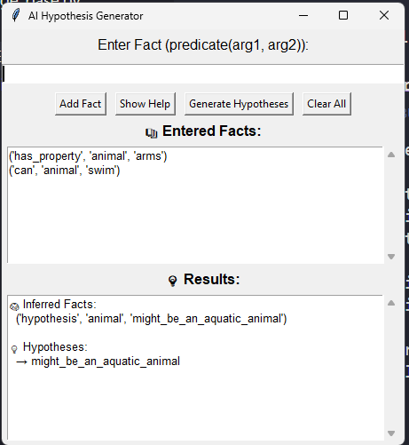
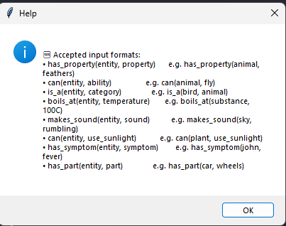

### 🔍 AI Hypothesis Generator (CLI)

#### 💬 How to enter facts:
  → Format: predicate(arg1, arg2)
  → Example: has_property(sky, dark)
  → Type 'done' when you're finished.

Enter fact: help

🆘 Help - Accepted input formats:
   • has_property(entity, property)      → e.g. has_property(animal, feathers)
   • can(entity, ability)                → e.g. can(animal, fly)
   • is_a(entity, category)              → e.g. is_a(bird, animal)
   • boils_at(entity, temperature)       → e.g. boils_at(substance, 100C)
   • makes_sound(entity, sound)          → e.g. makes_sound(sky, rumbling)
   • use_sunlight(entity, action)        → e.g. can(plant, use_sunlight)
   • has_symptom(entity, symptom)        → e.g. has_symptom(john, fever)
   • has_part(entity, part)              → e.g. has_part(car, wheels)
   • Type 'done' to finish entering facts
   • Type 'help' to view this message again

Enter fact: has_property(animal, feathers)
Enter fact: can(animal, fly)                  
Enter fact: done                

📚 Initial Facts:
  ('has_property', 'animal', 'feathers')
  ('can', 'animal', 'fly')

🧠 Inferred Facts:
  ('hypothesis', 'animal', 'might_be_a_bird')

💡 Hypotheses:
  → might_be_a_bird

## GUI Guide

Hey, there i am Chirag and today i willbe guiding you to how to use our Hypothesis generator app

##### Our GUI Page(gui.py):

we can see the first text-box for entring facts where an user can enter facts in different format and ways.

to kwon all that we provided "Show Help" button listing all Fuction to user

##### Help page:

Help - Accepted input formats:
   • has_property(entity, property)      → e.g. has_property(animal, feathers)
   • can(entity, ability)                → e.g. can(animal, fly)
   • is_a(entity, category)              → e.g. is_a(bird, animal)
   • boils_at(entity, temperature)       → e.g. boils_at(substance, 100C)
   • makes_sound(entity, sound)          → e.g. makes_sound(sky, rumbling)
   • use_sunlight(entity, action)        → e.g. can(plant, use_sunlight)
   • has_symptom(entity, symptom)        → e.g. has_symptom(john, fever)
   • has_part(entity, part)              → e.g. has_part(car, wheels)

##### After looking at help page:
user will add facts e.g: shown in above gui.py image where 2 facts been added:
- has_property(animal,arms),
- can(animal,swim)

##### After Adding at least 2 Facts:
   • Click on 'Generate Hyphothesis' button to generate hyphothesis based on the inserted facts
   
now thw user can see the generated hyphothisis in result box 

from here user can also add more facts which will pile-up on prevese fatcs or can click on "Clear All" button to start from new.

thank you for your time to read and consider our app and give it an try   -@Chirag_Varu